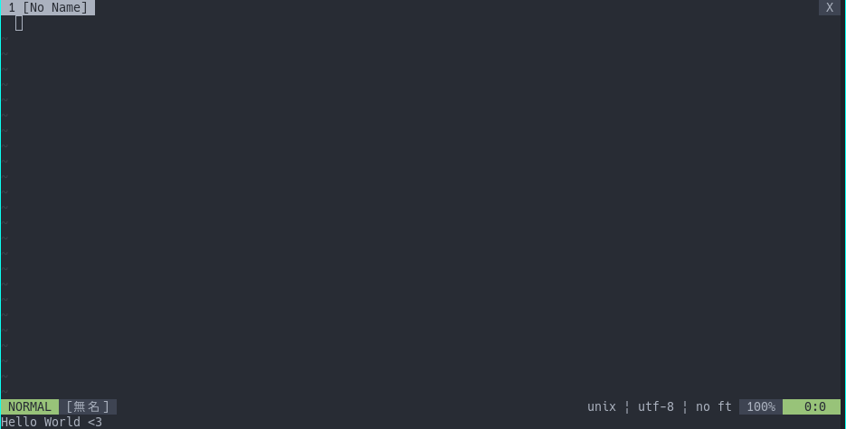

# Hello World <3

コマンドラインにいつでも`Hello World <3`と表示出来るようにするプラグインです。

# Requiament
初心

# Usage
コマンド `:SayHello`か`<Plug>(say-hello)`をマップして実行してください。
```vim
:SayHello
```

```
nmap <Plug>(say-hello)
```

# License
MIT
